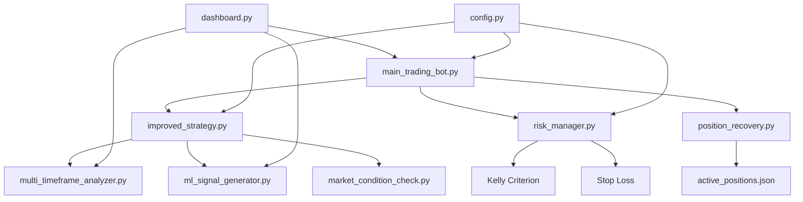
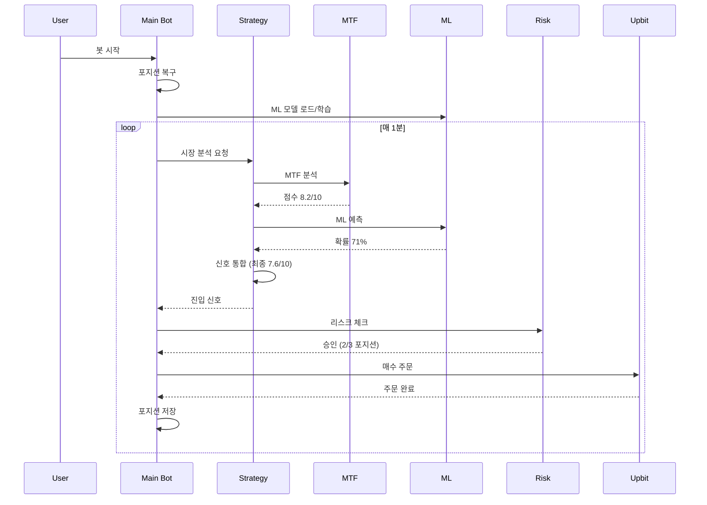
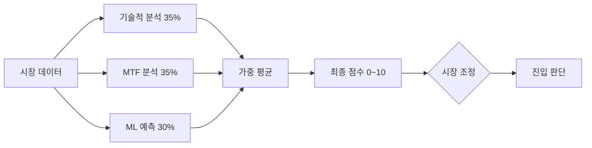

# 🤖 Upbit 자동매매 봇 완벽 기술 문서 v2.0

## 📋 목차
1. [시스템 개요](#시스템-개요)
2. [아키텍처](#아키텍처)
3. [핵심 모듈](#핵심-모듈)
4. [신호 시스템](#신호-시스템)
5. [리스크 관리](#리스크-관리)
6. [설정 가이드](#설정-가이드)
7. [설치 및 실행](#설치-및-실행)
8. [모니터링](#모니터링)
9. [문제 해결](#문제-해결)
10. [성능 최적화](#성능-최적화)

---

## 시스템 개요

### 🎯 목적
업비트 거래소에서 **기술적 분석**, **멀티 타임프레임 분석**, **머신러닝 예측**을 결합하여 자동으로 암호화폐를 매매하는 시스템

### 📊 버전 정보
```
버전: v2.0 (2025-10-12)
Python: 3.10+
주요 라이브러리:
  - pyupbit: 업비트 API
  - scikit-learn: 머신러닝
  - pandas, numpy: 데이터 처리
  - rich: 대시보드
```

### 🌟 주요 특징

#### 1. 3중 신호 시스템
```
기술적 분석 (35%) + MTF 분석 (35%) + ML 예측 (30%)
→ 가중 평균으로 최종 진입 결정
```

#### 2. 고급 리스크 관리
```
- Kelly Criterion 기반 포지션 사이징
- 동적 손절/익절 (시간 기반 조정)
- 추적 손절 (Trailing Stop)
- 일일/연속 손실 제한
```

#### 3. 적응형 전략
```
- 시장 상황 분석 (Bullish/Bearish/Neutral)
- 동적 진입 기준 조정
- 자동 재학습 (ML 모델)
- 동적 코인 선택
```

#### 4. 포지션 복구
```
- 봇 재시작 시 기존 포지션 자동 복구
- 거래소 잔고와 동기화
- 중단 없는 거래 지속
```

### 📈 성능 목표
```
승률 목표: 55% 이상
일일 수익: +1~3%
최대 손실: -2% (일일 제한)
거래 빈도: 1~10회/일
```

---

## 아키텍처

### 🏗️ 시스템 구조



### 📁 파일 구조
```
trading_bot/
├── 📄 main_trading_bot.py           # 메인 봇 (진입점)
├── 📄 improved_strategy.py          # 전략 & 신호 통합
├── 📄 multi_timeframe_analyzer.py   # MTF 분석
├── 📄 ml_signal_generator.py        # ML 예측
├── 📄 market_condition_check.py     # 시장 분석
├── 📄 risk_manager.py               # 리스크 관리
├── 📄 position_recovery.py          # 포지션 복구
├── 📄 momentum_scanner.py           # 동적 코인 선택
├── 📄 daily_summary.py              # 일일 요약
├── 📄 dashboard.py                  # 실시간 대시보드
├── 📄 config.py                     # 설정 파일
│
├── 📦 ml_model_random_forest.pkl    # 학습된 ML 모델
├── 📦 ml_scaler.pkl                 # ML 스케일러
├── 📦 active_positions.json         # 활성 포지션
├── 📄 trading.log                   # 거래 로그
├── 📄 .env                          # API 키
└── 📄 requirements.txt              # 의존성
```

### 🔄 실행 흐름



---

## 핵심 모듈

### 1️⃣ main_trading_bot.py (메인 봇)

#### 역할
```
- 전체 시스템 orchestration
- 매수/매도 실행
- 포지션 관리
- 주기적 상태 출력
```

#### 주요 메서드
```python
class TradingBot:
    def __init__(self, access_key, secret_key)
        # 초기화 및 포지션 복구
    
    def run(self)
        # 메인 루프
    
    def execute_trade(self, symbol, trade_type)
        # 거래 실행
    
    def check_exit_conditions(self)
        # 청산 조건 확인
    
    def analyze_and_trade(self)
        # 시장 분석 및 거래
    
    def print_status(self)
        # 5분마다 상태 출력
```

#### 실행 주기
```
매 1분: 
  - 포지션 저장
  - 청산 조건 체크
  - 새로운 거래 기회 탐색

매 5분:
  - 상태 출력 (잔고, 손익, 포지션)

매 6시간:
  - 동적 코인 스캔

매일 자정:
  - 일일 통계 리셋
```

---

### 2️⃣ improved_strategy.py (전략 & 신호 통합)

#### 역할
```
- 3가지 신호 통합
- 진입 조건 판단
- 거래 기록 관리
```

#### 신호 통합 로직
```python
# 1. 각 신호 정규화 (0~1)
technical_score = calculate_entry_score() / 12.0
mtf_score = mtf_analyzer.analyze() / 10.0
ml_score = ml_generator.predict()

# 2. 가중 평균
final_score = (
    technical_score * 0.35 +
    mtf_score * 0.35 +
    ml_score * 0.30
) * 10  # 0~10 스케일

# 3. 시장 조정
if market == 'bearish':
    threshold = 6.5
elif market == 'bullish':
    threshold = 5.0
else:
    threshold = 5.5

# 4. 최종 판단
if final_score >= threshold:
    return True, "진입 승인"
```

#### 주요 메서드
```python
should_enter_position(symbol, indicators)
    # 진입 여부 판단

calculate_entry_score(indicators)
    # 기술적 분석 점수 계산

can_exit_position(symbol, force_stop_loss)
    # 청산 가능 여부

record_trade(symbol, trade_type)
    # 거래 기록
```

---

### 3️⃣ multi_timeframe_analyzer.py (MTF 분석)

#### 역할
```
- 1시간 / 4시간 / 일봉 동시 분석
- 타임프레임 간 합의 계산
- 추세 일관성 확인
```

#### 분석 프로세스
```python
# 1. 각 타임프레임 분석
for timeframe in ['1h', '4h', '1d']:
    score = analyze_timeframe(timeframe)
    # 점수: 0~10

# 2. 가중 평균
final_score = (
    score_1h * 0.3 +
    score_4h * 0.4 +  # 가장 중요
    score_1d * 0.3
)

# 3. 합의 계산
consensus = calculate_consensus(trends)
# 85% = 모든 타임프레임 동의

# 4. 신호 강도
if final_score >= 8.0 and consensus >= 0.80:
    strength = "strong"
```

#### 주요 메서드
```python
analyze(symbol)
    # 전체 분석 실행
    # 반환: {final_score, consensus, trend, strength}

_analyze_timeframe(ticker, interval, count)
    # 개별 타임프레임 분석

_calculate_consensus(timeframe_results)
    # 합의 수준 계산

get_entry_recommendation(symbol)
    # 진입 추천 여부
```

#### 캐싱
```python
# 5분간 결과 캐시
if cached and elapsed < 300:
    return cached_result
else:
    return new_analysis
```

---

### 4️⃣ ml_signal_generator.py (ML 예측)

#### 역할
```
- Random Forest 모델 학습
- 6시간 후 수익률 예측
- 매수 확률 제공
```

#### 학습 프로세스
```python
# 1. 데이터 수집 (168시간)
for symbol in ['BTC', 'ETH', 'SOL']:
    df = pyupbit.get_ohlcv(ticker, "minute60", 2000)
    
    # 2. 특성 생성 (30개)
    features = create_features(df)
    # returns, sma, rsi, macd, volume, etc.
    
    # 3. 레이블 생성
    future_return = (price[t+6h] - price[t]) / price[t]
    label = 1 if future_return > 0.015 else 0
    
# 4. 모델 학습
model = RandomForestClassifier(n_estimators=100)
model.fit(X_train_scaled, y_train)

# 5. 저장
pickle.dump(model, 'ml_model_random_forest.pkl')
```

#### 예측 프로세스
```python
# 1. 최신 데이터
df = pyupbit.get_ohlcv(ticker, "minute60", 100)

# 2. 특성 계산
features = create_features(df)

# 3. 스케일링
features_scaled = scaler.transform(features)

# 4. 예측
probability = model.predict_proba(features_scaled)[0]
# [0.287, 0.713] = [하락, 상승]

# 5. 반환
return {
    'buy_probability': 0.713,
    'confidence': 0.713,
    'prediction': True
}
```

#### 주요 메서드
```python
train_model(symbols, retrain=False)
    # 모델 학습

predict(symbol)
    # 예측 실행

evaluate_recent_performance(symbols, days)
    # 성능 평가

_create_features(df)
    # 30개 특성 생성
```

#### 자동 재학습
```
초기: 봇 시작 시 자동 학습 (5~10분)
주기: 7일마다 자동 재학습
조건: 성능 < 50% 시 재학습
```

---

### 5️⃣ risk_manager.py (리스크 관리)

#### 역할
```
- 포지션 크기 계산 (Kelly Criterion)
- 손절/익절 관리
- 일일 손실 제한
- 통계 추적
```

#### Kelly Criterion
```python
# 최적 포지션 크기 계산
p = win_rate  # 승률
b = avg_win / avg_loss  # 손익비
kelly = (p * b - (1-p)) / b

# 보수적 적용 (1/4 Kelly)
position_size = balance * kelly * 0.25

# 제한
position_size = min(position_size, balance * 0.25)
```

#### 동적 손절
```python
# 시간에 따라 손절선 조정
holding_hours = (now - entry_time).hours
adjusted_stop_loss = base_stop_loss * (1 - min(holding_hours / 24, 0.3))

# 예:
# 0시간: -1.2%
# 12시간: -0.96%
# 24시간: -0.84%
```

#### 추적 손절
```python
# 최고가 대비 하락 시 청산
if profit > 2%:  # 수익 중일 때만
    trailing_stop = highest_price * 0.99  # 1% 하락
    if current_price <= trailing_stop:
        sell()
```

#### 주요 메서드
```python
calculate_position_size(balance, symbol, price, volatility)
    # Kelly + 변동성 + 연속손실 조정

check_stop_loss(symbol, current_price)
    # 손절 체크 (시간 기반 조정)

check_trailing_stop(symbol, current_price)
    # 추적 손절 체크

check_daily_loss_limit()
    # 일일 손실 한도 체크

update_position(symbol, price, quantity, type)
    # 포지션 업데이트 & 통계

can_open_new_position()
    # 신규 포지션 가능 여부
```

---

### 6️⃣ position_recovery.py (포지션 복구)

#### 역할
```
- 봇 재시작 시 기존 포지션 복구
- 파일 저장/로드
- 거래소 동기화
```

#### 복구 프로세스
```python
# 1. 저장된 포지션 로드
with open('active_positions.json') as f:
    saved_positions = json.load(f)

# 2. 거래소 실제 잔고 확인
balances = upbit.get_balances()

# 3. 동기화
for symbol, balance in balances:
    if symbol in saved_positions:
        # 저장된 정보 사용
        position = saved_positions[symbol]
    else:
        # 평균 매수가 사용
        position = {
            'entry_price': balance['avg_buy_price'],
            'quantity': balance['balance']
        }

# 4. risk_manager에 등록
risk_manager.positions[symbol] = position
```

#### 저장 형식
```json
{
  "timestamp": "2025-10-12T00:05:20",
  "positions": {
    "BTC": {
      "entry_price": 142500000,
      "quantity": 0.0038,
      "entry_time": "2025-10-12T00:00:00"
    },
    "ETH": {...}
  }
}
```

---

### 7️⃣ market_condition_check.py (시장 분석)

#### 역할
```
- 전체 시장 상황 판단
- 진입 기준 동적 조정
- 포지션 크기 조정
```

#### 분석 로직
```python
# 상위 3개 코인 최근 3일 변동률 확인
for coin in ['BTC', 'ETH', 'SOL']:
    df = pyupbit.get_ohlcv(ticker, "day", 3)
    change = (df['close'][-1] - df['close'][0]) / df['close'][0]
    
    if change > 3%:
        bullish_count += 1
    elif change < -3%:
        bearish_count += 1

# 판단
if bearish_count >= 2:
    market = 'bearish'  # 약세장
elif bullish_count >= 2:
    market = 'bullish'  # 강세장
else:
    market = 'neutral'  # 중립
```

#### 기준 조정
```python
# 시장별 진입 기준
if market == 'bearish':
    threshold = base_threshold + 1.0  # 더 엄격
    position_multiplier = 0.7  # 포지션 축소
elif market == 'bullish':
    threshold = base_threshold - 0.5  # 완화
    position_multiplier = 1.1  # 포지션 확대
else:
    threshold = base_threshold
    position_multiplier = 1.0
```

---

### 8️⃣ dashboard.py (실시간 대시보드)

#### 역할
```
- 실시간 모니터링
- MTF/ML 분석 표시
- 다중 기간 통계 (24h/7d/30d)
```

#### 레이아웃
```
┌─────────────────────────────────────────┐
│  HEADER (시간, 코인)                     │
├───────────┬─────────────┬───────────────┤
│  가격     │  시장동향   │  MTF 분석     │
├───────────┼─────────────┼───────────────┤
│  포지션   │  동적코인   │  ML 예측      │
├───────────┴─────────────┴───────────────┤
│  24시간   │   7일      │   30일        │
├───────────────────────────────────────────┤
│  FOOTER (API, 설정)                      │
└─────────────────────────────────────────┘
```

#### 캐싱 전략
```python
# API 절약
price_cache: 30초
change_cache: 5분
top_movers: 5분

# 총 API 호출: < 300/분 (제한 600/분)
```

---

## 신호 시스템

### 🎯 3중 신호 통합



### 1. 기술적 분석 (35%)

#### 계산 요소
```python
1. 추세 (0~2.5점)
   - SMA20 > SMA50 and Price > SMA20: 2.5점
   
2. RSI (0~3점)
   - 30 < RSI < 40: 3점 (과매도 반등)
   - 40 < RSI < 50: 2점
   
3. MACD (0~2점)
   - MACD > Signal and MACD > 0: 2점
   
4. 볼륨 (0~2점)
   - 거래량 > 평균 * 1.5: 2점
   
5. 변동성 (0~2점)
   - 0.01 < ATR < 0.02: 2점

총점: 12점 → 정규화 → 0~1
```

### 2. MTF 분석 (35%)

#### 타임프레임별 가중치
```python
1시간: 30%  # 단기 타이밍
4시간: 40%  # 중기 방향 (가장 중요)
일봉:  30%  # 장기 확인

최종 점수: 0~10점
합의 수준: 0~100%
```

#### 신호 강도
```
strong:   점수 8.0+ & 합의 80%+
moderate: 점수 6.0+ & 합의 65%+
weak:     나머지
```

### 3. ML 예측 (30%)

#### 모델 출력
```python
buy_probability: 0~1  # 매수 확률
confidence: 0~1       # 신뢰도
prediction: True/False # 최종 예측

# 예: 0.713 = 71.3% 확률로 6시간 후 1.5% 상승
```

### 최종 통합 예시

```python
# 입력
technical = 0.75  # 75/100점
mtf = 0.82        # 8.2/10점
ml = 0.71         # 71% 확률

# 가중 평균
final = (0.75 * 0.35 + 0.82 * 0.35 + 0.71 * 0.30) * 10
      = (0.2625 + 0.287 + 0.213) * 10
      = 7.625/10

# 시장 조정 (중립장)
threshold = 5.5

# 판단
7.625 >= 5.5 → 진입 승인 ✅
```

---

## 리스크 관리

### 🛡️ 다층 보호 시스템

```
1단계: 진입 전 검증
  - 일일 거래 한도 (10회)
  - 최대 포지션 (3개)
  - 쿨다운 (30분)
  - 연속 손실 (2회)

2단계: 포지션 크기 제한
  - Kelly Criterion (최적 크기)
  - 변동성 조정
  - 최대 25% (단일 포지션)

3단계: 실시간 모니터링
  - 손절: -1.2%
  - 추적 손절: 최고가 -1%
  - 목표: +1.0%

4단계: 일일 제한
  - 일일 손실: -2%
  - 자본 보호: -5% (중단)
```

### 📊 포지션 크기 계산

```python
# 1. 기본 크기 (Kelly)
kelly_size = balance * kelly_fraction
# kelly_fraction ≈ 0.02~0.10

# 2. 변동성 조정
volatility_adj = min(1.0, 0.02 / volatility)
adjusted_size = kelly_size * volatility_adj

# 3. 연속 손실 조정
if consecutive_losses > 0:
    loss_adj = 1.0 / (1 + consecutive_losses * 0.2)
    final_size = adjusted_size * loss_adj

# 4. 제한 적용
final_size = min(final_size, balance * 0.25)
```

### 🎯 청산 우선순위

```python
Priority 1: 손절 (-1.2%)
  - 즉시 실행
  - 보유시간 무시
  - 강제 매도

Priority 2: 추적 손절
  - 수익 > 2% 일 때
  - 최고가 -1%
  - 보유시간 1시간 이상

Priority 3: 목표 수익 (+1.0%)
  - 보유시간 1시간 이상
  - 정상 매도
```

---

## 설정 가이드

### ⚙️ config.py 주요 설정

#### 1. 기본 전략
```python
STRATEGY_CONFIG = {
    'min_profit_target': 0.01,       # 목표 수익 1%
    'max_trades_per_day': 10,        # 일일 최대 10회
    'min_hold_time': 3600,           # 최소 1시간 보유
}
```

#### 2. 리스크 관리
```python
RISK_CONFIG = {
    'max_position_size': 0.25,       # 단일 포지션 25%
    'stop_loss': 0.012,              # 손절 -1.2%
    'daily_loss_limit': 0.02,        # 일일 손실 -2%
    'max_positions': 3,              # 최대 3개 보유
}
```

#### 3. MTF 설정
```python
MTF_CONFIG = {
    'enabled': True,
    'min_score': 6.0,                # 최소 점수
    'min_consensus': 0.65,           # 최소 합의 65%
    'timeframes': {
        '1h': {'weight': 0.3},
        '4h': {'weight': 0.4},       # 가장 중요
        '1d': {'weight': 0.3},
    }
}
```

#### 4. ML 설정
```python
ML_CONFIG = {
    'enabled': True,
    'model_type': 'random_forest',
    'prediction': {
        'min_buy_probability': 0.65,  # 최소 확률 65%
        'min_confidence': 0.60,       # 최소 신뢰도 60%
    },
    'training': {
        'auto_retrain_days': 7,       # 7일마다 재학습
    }
}
```

#### 5. 신호 통합
```python
SIGNAL_INTEGRATION_CONFIG = {
    'enabled': True,
    'weights': {
        'technical': 0.35,            # 기술적 35%
        'mtf': 0.35,                  # MTF 35%
        'ml': 0.30,                   # ML 30%
    },
    'entry_mode': 'weighted',         # 가중 평균
}
```

#### 6. 전략 프리셋
```python
# 보수적
STRATEGY_PRESETS['conservative'] = {
    'entry_score_threshold': 6.5,
    'mtf_min_score': 7.0,
    'ml_min_probability': 0.70,
    'max_positions': 2,
    'stop_loss': 0.010,
}

# 균형 (기본)
STRATEGY_PRESETS['balanced'] = {
    'entry_score_threshold': 5.5,
    'mtf_min_score': 6.0,
    'ml_min_probability': 0.65,
    'max_positions': 3,
    'stop_loss': 0.012,
}

# 공격적
STRATEGY_PRESETS['aggressive'] = {
    'entry_score_threshold': 5.0,
    'mtf_min_score': 5.5,
    'ml_min_probability': 0.60,
    'max_positions': 4,
    'stop_loss': 0.015,
}
```

---

## 설치 및 실행

### 📦 설치

#### 1. 필수 패키지
```bash
# Python 3.10+ 필요
pip install pyupbit==0.2.31
pip install pandas==2.0.3
pip install numpy==1.26.4
pip install scikit-learn==1.3.0
pip install python-dotenv==1.0.0
pip install rich==13.0.0
```

#### 2. requirements.txt
```txt
pyupbit>=0.2.31
pandas==2.0.3
numpy==1.26.4
scikit-learn==1.3.0
python-dotenv>=1.0.0
rich>=13.0.0
```

```bash
pip install -r requirements.txt
```

#### 3. API 키 설정
```.env
UPBIT_ACCESS_KEY=your_access_key_here
UPBIT_SECRET_KEY=your_secret_key_here
```

**API 키 발급 방법**:
1. 업비트 로그인 → 고객센터 → Open API 관리
2. 새로운 API 키 발급
3. 권한 설정: 자산 조회, 주문 조회, 주문하기
4. IP 주소 등록 (선택)

---

### 🚀 실행

#### 1. 테스트 모드
```bash
python main_trading_bot.py
```

```
실행 모드를 선택하세요:
1. 테스트 모드 (거래 없이 신호만 확인)
2. 실전 모드 (실제 거래 실행)

선택 (1 또는 2): 1
```

**테스트 모드**:
- 실제 거래 없음
- 신호만 출력
- 안전하게 테스트 가능

#### 2. 실전 모드
```bash
python main_trading_bot.py
```

```
선택 (1 또는 2): 2

⚠️  실제 자금으로 거래가 실행됩니다!
정말 실전 거래를 시작하시겠습니까? (yes 입력): yes

🚀 실전 모드로 실행합니다...
```

**실전 모드**:
- 실제 매수/매도 실행
- 자금 사용
- 주의 필요

#### 3. 대시보드 실행 (별도 터미널)
```bash
# 다른 터미널 창에서
python dashboard.py
```

**대시보드 기능**:
- 실시간 가격 모니터링
- MTF/ML 분석 표시
- 포지션 손익 확인
- 24h/7d/30d 통계

---

### 🔄 재시작 시나리오

#### 시나리오 1: 포지션 없이 재시작
```bash
python main_trading_bot.py

# 출력
봇 초기화 완료. 초기 자본: 1,000,000 KRW
기존 포지션 확인 중...
저장된 포지션 없음
복구 완료: 0개 포지션
```

#### 시나리오 2: 포지션 있는 상태로 재시작
```bash
python main_trading_bot.py

# 출력
📦 기존 포지션 발견:
  BTC: +2.5% (진입가: 142,500,000)
  ETH: -1.2% (진입가: 4,850,000)
  SOL: +0.8% (진입가: 245,000)

어떻게 처리하시겠습니까?
1. 기존 포지션 유지하고 계속
2. 모든 포지션 강제 청산 (보유시간 무시)
3. 선택적으로 청산

선택 (1/2/3): 1

✅ 포지션 복구: BTC @ 142,500,000
✅ 포지션 복구: ETH @ 4,850,000
✅ 포지션 복구: SOL @ 245,000
복구 완료: 3개 포지션
```

---

## 모니터링

### 📊 대시보드 화면

#### 상단 (메인 콘텐츠)
```
┌─────────────┬──────────────┬─────────────┐
│  가격 리스트 │  TOP 5 동향  │  MTF 분석   │
│  BTC: +0.5% │  Gainers:    │  Score: 8.2 │
│  ETH: -0.2% │  1. DOGE +5% │  합의: 85%  │
│  SOL: +1.2% │  2. ADA +3%  │  추세: UP   │
│             │              │  강도:STRONG│
├─────────────┼──────────────┼─────────────┤
│  포지션     │  동적 코인    │  ML 예측    │
│  BTC: +1.5% │  DOGE: +4.2% │  확률: 71%  │
│  ETH: -0.8% │  AVAX: +3.1% │  신뢰: 73%  │
│  보유 0.5h  │              │  BUY Signal │
└─────────────┴──────────────┴─────────────┘
```

#### 하단 (통계)
```
┌──────────────┬──────────────┬──────────────┐
│  24시간      │   7일        │   30일       │
│  PnL: +15k   │  PnL: +85k   │  PnL: +320k  │
│  Return:+1.5%│  Return:+8.5%│  Return:+32% │
│  Trades: 8   │  Trades: 45  │  Trades: 180 │
│  Win: 62.5%  │  Win: 64.4%  │  Win: 63.3%  │
└──────────────┴──────────────┴──────────────┘
```

### 📝 로그 모니터링

#### 실시간 로그 확인
```bash
tail -f trading.log
```

#### 주요 로그 필터링
```bash
# 매수/매도만 확인
tail -100 trading.log | grep "완료"

# MTF 분석만 확인
tail -100 trading.log | grep "MTF"

# ML 예측만 확인
tail -100 trading.log | grep "ML"

# 에러만 확인
tail -100 trading.log | grep "ERROR"
```

### 🔔 상태 출력 (5분마다)

```
============================================================
⏰ 2025-10-12 00:07:22
============================================================
📈 시장 상황: ➡️ NEUTRAL
💰 KRW 잔고: 544,995 원
📊 총 자산가치: 617,446 원
📈 일일 손익: +0 원 (+0.00%)
🎯 승률: 50.0% / Kelly: 4.2%
🔄 오늘 거래: 0/10
📦 활성 포지션: 3/3

📌 보유 포지션:
  BTC: -0.14% (보유 0.4시간)
  ETH: +0.29% (보유 0.4시간)
  SOL: +0.65% (보유 0.4시간)
============================================================
```

### 📈 성능 지표

#### 주요 KPI
```python
1. 승률 (Win Rate)
   - 계산: 이긴 거래 / 전체 거래
   - 목표: 55% 이상
   
2. 손익비 (P/L Ratio)
   - 계산: 평균 수익 / 평균 손실
   - 목표: 1.5 이상
   
3. Kelly Fraction
   - 계산: (p*b - q) / b
   - 범위: 0.01~0.10
   
4. 일일 수익률
   - 계산: 일일 손익 / 초기 자본
   - 목표: +1~3%
   
5. 최대 낙폭 (MDD)
   - 계산: (최고점 - 최저점) / 최고점
   - 목표: < 10%
```

---

## 문제 해결

### ❌ 자주 발생하는 문제

#### 1. numpy 버전 오류
```
에러: No module named 'numpy.exceptions'
```

**해결**:
```bash
pip uninstall numpy -y
pip install numpy==1.26.4
```

#### 2. ML 모델 학습 실패
```
에러: 학습 데이터 부족
```

**해결**:
```python
# config.py
ML_CONFIG['training']['lookback_hours'] = 100  # 168 → 100
ML_CONFIG['training']['min_samples'] = 100     # 200 → 100
```

#### 3. API 호출 제한
```
에러: API rate limit exceeded
```

**해결**:
```python
# config.py
MTF_CONFIG['cache_duration'] = 600  # 300 → 600초

# dashboard.py
time.sleep(15)  # 10초 → 15초
```

#### 4. 포지션 저장 실패
```
에러: Permission denied: active_positions.json
```

**해결**:
```bash
# 권한 부여
chmod 666 active_positions.json

# 또는 파일 재생성
rm active_positions.json
python main_trading_bot.py
```

#### 5. 메모리 부족
```
에러: MemoryError
```

**해결**:
```python
# config.py
ML_CONFIG['training']['lookback_hours'] = 100
TRADING_PAIRS = ['BTC', 'ETH']  # SOL 제외
```

#### 6. 거래가 발생하지 않음
```
로그: 포지션 저장만 반복
```

**원인 분석**:
```
1. 최대 포지션 보유 중 (3/3)
   → 청산 대기
   
2. 진입 점수 부족
   → 로그 확인: "진입 조건 미충족"
   
3. 리스크 제한
   → "일일 거래 한도", "연속 손실"
```

**해결**:
```bash
# 로그 확인
tail -50 trading.log | grep "진입"
tail -50 trading.log | grep "리스크"

# 설정 완화 (주의!)
ADVANCED_CONFIG['entry_score_threshold'] = 5.0  # 5.5 → 5.0
```

---

## 성능 최적화

### ⚡ API 호출 최적화

#### 1. 캐싱 전략
```python
# 가격: 30초 캐시
price_cache[ticker] = {
    'price': current_price,
    'timestamp': now,
    'ttl': 30
}

# 변동률: 5분 캐시
change_cache[ticker] = {
    'change': change_rate,
    'timestamp': now,
    'ttl': 300
}

# MTF 분석: 5분 캐시
mtf_cache[symbol] = {
    'analysis': result,
    'timestamp': now,
    'ttl': 300
}
```

#### 2. 배치 처리
```python
# 나쁜 예
for symbol in TRADING_PAIRS:
    price = pyupbit.get_current_price(f"KRW-{symbol}")
    # API 호출 3회

# 좋은 예
tickers = [f"KRW-{s}" for s in TRADING_PAIRS]
prices = pyupbit.get_current_price(tickers)
# API 호출 1회
```

### 🚀 성능 개선 팁

#### 1. 불필요한 분석 제거
```python
# 이미 포지션 보유 중이면 스킵
if symbol in self.risk_manager.positions:
    logger.debug(f"{symbol}: 이미 포지션 보유")
    continue  # 분석 생략
```

#### 2. 병렬 처리 (고급)
```python
from concurrent.futures import ThreadPoolExecutor

# 여러 코인 동시 분석
with ThreadPoolExecutor(max_workers=3) as executor:
    futures = [
        executor.submit(self.analyze_symbol, symbol)
        for symbol in TRADING_PAIRS
    ]
    results = [f.result() for f in futures]
```

#### 3. 메모리 관리
```python
# 오래된 로그 정리
if len(self.all_trades_history) > 1000:
    self.all_trades_history = self.all_trades_history[-500:]

# 캐시 정리
if len(self.cache) > 100:
    # 오래된 항목 제거
    old_keys = [k for k, v in self.last_update.items() 
                if (now - v).seconds > 3600]
    for key in old_keys:
        del self.cache[key]
```

### 📊 백테스팅 (선택)

#### 간단한 백테스트
```python
def backtest(self, start_date, end_date, initial_balance=1000000):
    """과거 데이터로 전략 테스트"""
    
    balance = initial_balance
    trades = []
    
    # 과거 데이터 수집
    for symbol in TRADING_PAIRS:
        df = pyupbit.get_ohlcv(
            f"KRW-{symbol}", 
            interval="minute60",
            to=end_date
        )
        
        # 시뮬레이션
        for i in range(len(df) - 24):
            current_data = df.iloc[i:i+100]
            
            # 신호 생성
            indicators = self.calculate_indicators(current_data)
            can_enter, reason = self.should_enter_position(
                symbol, indicators
            )
            
            if can_enter:
                # 가상 매수
                entry_price = df.iloc[i+1]['close']
                
                # 6시간 후 결과
                exit_price = df.iloc[i+7]['close']
                pnl = (exit_price - entry_price) / entry_price
                
                trades.append({
                    'symbol': symbol,
                    'entry': entry_price,
                    'exit': exit_price,
                    'pnl': pnl
                })
    
    # 결과 분석
    win_rate = len([t for t in trades if t['pnl'] > 0]) / len(trades)
    avg_pnl = sum([t['pnl'] for t in trades]) / len(trades)
    
    return {
        'trades': len(trades),
        'win_rate': win_rate,
        'avg_pnl': avg_pnl
    }
```

---

## 고급 기능

### 🎯 동적 코인 선택

#### 모멘텀 스캐너
```python
# momentum_scanner.py
class MomentumScanner:
    def scan_top_performers(self, top_n=2):
        """상위 모멘텀 코인 선택"""
        
        # 주요 코인 분석
        coins = ['DOGE', 'SHIB', 'MATIC', 'ADA', 'AVAX', ...]
        
        scores = []
        for coin in coins:
            # 모멘텀 점수 계산
            score = self.calculate_momentum(coin)
            # volume, price change, trend 종합
            
            scores.append({
                'symbol': coin,
                'score': score
            })
        
        # 상위 N개 선택
        scores.sort(key=lambda x: x['score'], reverse=True)
        return [s['symbol'] for s in scores[:top_n]]
```

#### 사용 방법
```python
# config.py
DYNAMIC_COIN_CONFIG = {
    'enabled': True,
    'max_dynamic_coins': 2,      # 최대 2개 추가
    'refresh_interval': 21600,   # 6시간마다 갱신
    'min_score': 6,              # 최소 점수
}

# 실행
# 6시간마다 자동으로 STABLE_PAIRS + 동적 2개 거래
```

### 📊 상세 통계

#### 일일 요약
```python
# daily_summary.py
class DailySummary:
    def finalize_day(self, date):
        """일일 거래 요약"""
        
        trades = self.get_trades_for_date(date)
        
        summary = {
            'date': date,
            'total_trades': len(trades),
            'wins': len([t for t in trades if t['pnl'] > 0]),
            'losses': len([t for t in trades if t['pnl'] <= 0]),
            'total_pnl': sum([t['pnl'] for t in trades]),
            'largest_win': max([t['pnl'] for t in trades]),
            'largest_loss': min([t['pnl'] for t in trades]),
        }
        
        # 파일 저장
        self.save_summary(summary)
        
        return summary
```

### 🔔 알림 시스템 (확장 가능)

#### 텔레그램 연동 (예시)
```python
import requests

def send_telegram(message):
    """텔레그램 메시지 전송"""
    bot_token = "YOUR_BOT_TOKEN"
    chat_id = "YOUR_CHAT_ID"
    
    url = f"https://api.telegram.org/bot{bot_token}/sendMessage"
    data = {
        'chat_id': chat_id,
        'text': message,
        'parse_mode': 'HTML'
    }
    
    requests.post(url, data=data)

# 사용 예
send_telegram(f"""
🚀 <b>매수 완료</b>
코인: BTC
가격: 142,500,000원
점수: 7.8/10
""")
```

---

## 보안 및 주의사항

### 🔒 보안 체크리스트

- [ ] API 키를 `.env` 파일에 저장
- [ ] `.env` 파일을 `.gitignore`에 추가
- [ ] API 키 권한 최소화 (출금 권한 제외)
- [ ] IP 화이트리스트 설정 (선택)
- [ ] 정기적으로 API 키 갱신
- [ ] 로그 파일 권한 설정 (`chmod 600`)

### ⚠️ 리스크 경고

```
1. 암호화폐 거래는 고위험 투자입니다
2. 투자 원금 손실 가능성이 있습니다
3. 봇은 100% 수익을 보장하지 않습니다
4. 시장 급변 시 예상치 못한 손실 발생 가능
5. 초기에는 소액으로 테스트 권장
6. 봇을 맹신하지 말고 정기적으로 모니터링
```

### 💡 안전한 운영 가이드

```
1. 테스트 모드로 충분히 검증
2. 소액(10~50만원)으로 시작
3. 매일 상태 확인
4. 주간 성능 평가
5. 설정 점진적 조정
6. 비정상 동작 시 즉시 중단
7. 백업 정기적 실행
```

---

## 부록

### 📚 관련 문서

```
1. ML_Trading_Guide.md
   - 머신러닝 시스템 상세 설명
   
2. MTF_Trading_Guide.md
   - 멀티 타임프레임 분석 가이드
   
3. Signal_Analysis_Guide.md
   - 신호 판단 기준 (이전 공유)
```

### 🔗 유용한 링크

```
업비트 API: https://docs.upbit.com
pyupbit 문서: https://github.com/sharebook-kr/pyupbit
scikit-learn: https://scikit-learn.org
```

### 📊 체크리스트

#### 초기 설정
- [ ] Python 3.10+ 설치
- [ ] 필수 패키지 설치
- [ ] API 키 설정
- [ ] config.py 설정 확인
- [ ] 테스트 모드 실행
- [ ] 로그 확인
- [ ] 대시보드 실행

#### 일일 운영
- [ ] 대시보드 확인
- [ ] 포지션 손익 확인
- [ ] 로그 에러 확인
- [ ] API 상태 확인

#### 주간 점검
- [ ] 승률 확인 (> 55%)
- [ ] Kelly Fraction 확인
- [ ] ML 성능 평가
- [ ] 설정 최적화 검토

#### 월간 점검
- [ ] 전체 수익률 분석
- [ ] MDD 확인
- [ ] 백업 실행
- [ ] 전략 재평가

---

## FAQ

### Q1: 초기 자금은 얼마가 필요한가요?
```
A: 최소 50만원 이상 권장
   - 업비트 최소 주문: 5,000원
   - 3개 포지션 × 25% = 최소 60만원
   - 여유 자금 고려 시 100만원 추천
```

### Q2: 하루 수익률은 얼마나 되나요?
```
A: 평균 1~3% 목표
   - 변동성에 따라 -2% ~ +5%
   - 장기적으로 월 10~30% 목표
   - 보장된 수익은 없음
```

### Q3: 24시간 켜둬야 하나요?
```
A: 권장하지만 필수는 아님
   - 포지션 복구 기능으로 재시작 가능
   - 클라우드 서버 사용 권장 (AWS, GCP)
   - 또는 개인 서버/데스크톱 24시간 운영
```

### Q4: ML 모델 재학습은 언제 하나요?
```
A: 자동 + 수동
   - 자동: 7일마다
   - 수동: 성능 저하 시 (< 50%)
   - 명령: strategy.retrain_ml_model()
```

### Q5: 설정을 어떻게 조정하나요?
```
A: 3가지 프리셋 제공
   - conservative: 안전 우선
   - balanced: 균형 (기본)
   - aggressive: 수익 우선
   
   # config.py
   ACTIVE_PRESET = 'balanced'
```

### Q6: 손실이 계속 나면 어떻게 하나요?
```
A: 자동 보호 + 수동 조치
   - 자동: 연속 2회 손실 시 거래 중단
   - 자동: 일일 -2% 시 중단
   - 수동: 설정 재검토, 테스트 모드 전환
```

---

## 버전 히스토리

### v2.0 (2025-10-12) - 현재
```
✨ 신규 기능:
- 멀티 타임프레임 분석 (MTF)
- 머신러닝 예측 (ML)
- 3중 신호 통합 시스템
- 포지션 자동 복구
- 실시간 대시보드
- 다중 기간 통계 (24h/7d/30d)

🔧 개선사항:
- Kelly Criterion 포지션 사이징
- 동적 손절선 (시간 기반)
- 추적 손절 구현
- 시장 상황 분석
- API 캐싱 최적화

🐛 버그 수정:
- numpy 호환성 문제
- 포지션 중복 저장
- 메모리 누수
```

### v1.0 (2025-09-01)
```
- 기본 자동매매 기능
- 기술적 분석
- 단순 리스크 관리
```

---

## 라이선스 및 면책

```
이 소프트웨어는 교육 및 연구 목적으로 제공됩니다.

⚠️ 면책 조항:
- 투자 손실에 대한 책임은 사용자에게 있습니다
- 소프트웨어의 정확성을 보장하지 않습니다
- 실제 거래 전 충분한 테스트를 권장합니다
- 법적 문제 발생 시 책임지지 않습니다

📝 사용 약관:
- 개인적 용도로만 사용
- 상업적 이용 금지
- 재배포 시 출처 명시
```

---

## 지원 및 문의

### 🐛 버그 리포트
```
문제 발생 시 다음 정보 포함:
1. 에러 메시지 전체
2. trading.log 마지막 50줄
3. config.py 설정
4. Python/패키지 버전
```

### 💡 기능 제안
```
개선 아이디어 환영:
- 새로운 지표 추가
- 전략 최적화
- UI/UX 개선
- 성능 향상
```

---

**마지막 업데이트**: 2025-10-12
**버전**: v2.0
**작성자**: Upbit Auto Trading System Team

---

## 🎓 학습 로드맵

### 초급 (1주차)
```
Day 1-2: 시스템 개요 이해
Day 3-4: 설치 및 테스트 모드 실행
Day 5-6: 대시보드 모니터링
Day 7: 설정 조정 연습
```

### 중급 (2-4주차)
```
Week 2: 신호 시스템 이해 (기술적/MTF/ML)
Week 3: 리스크 관리 심화
Week 4: 실전 모드 소액 운영
```

### 고급 (5주차+)
```
Week 5+: 커스텀 전략 개발
- 새로운 지표 추가
- 전략 백테스팅
- 성능 최적화
- 알림 시스템 구축
```

---

**🚀 이제 시작할 준비가 되었습니다!**

```
1. requirements.txt 설치
2. .env 파일 생성
3. config.py 확인
4. 테스트 모드 실행
5. 대시보드 모니터링
6. 실전 시작 (소액)

행운을 빕니다! 📈
```
