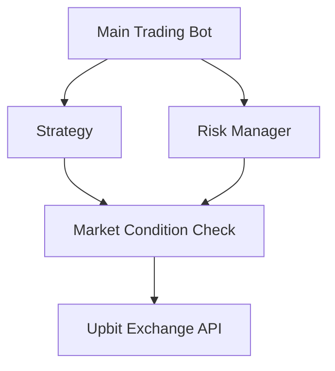

# 업비트 자동매매 봇 기술 문서

# 목차

1. [시스템 아키텍처](https://www.notion.so/280b03c17d8480539999cfbac80f8974?pvs=21)
2. [핵심 전략 로직](https://www.notion.so/280b03c17d8480539999cfbac80f8974?pvs=21)
3. [리스크 관리 시스템](https://www.notion.so/280b03c17d8480539999cfbac80f8974?pvs=21)
4. [기술적 지표 분석](https://www.notion.so/280b03c17d8480539999cfbac80f8974?pvs=21)
5. [포지션 관리](https://www.notion.so/280b03c17d8480539999cfbac80f8974?pvs=21)
6. [시장 상황 분석](https://www.notion.so/280b03c17d8480539999cfbac80f8974?pvs=21)
7. [성과 모니터링](https://www.notion.so/280b03c17d8480539999cfbac80f8974?pvs=21)

---

## 1. 시스템 아키텍처

### 1.1 전체 구조


```mermaid
graph TD
    A[Main Trading Bot] --> B[Strategy]
    A --> C[Risk Manager]
    B --> D[Market Condition Check]
    C --> D
    D --> E[Upbit Exchange API]
```

### 1.2 핵심 컴포넌트

| 컴포넌트 | 파일명 | 역할 |
| --- | --- | --- |
| 메인 봇 | main_trading_bot.py | 전체 로직 조율 및 실행 |
| 전략 엔진 | improved_strategy.py | 진입/청산 신호 생성 |
| 리스크 관리 | risk_manager.py | 포지션 크기 및 손실 관리 |
| 시장 분석 | market_condition_check.py | 시장 상황 판단 |
| 포지션 복구 | position_recovery.py | 재시작 시 포지션 복원 |

---

## 2. 핵심 전략 로직

### 2.1 진입 점수 시스템

**12점 만점 스코어링 시스템**

```markdown
## 진입 점수 시스템

진입 점수 = Σ(각 지표 점수)

### 구성 요소:
- **추세 조건**: 최대 3점
- **RSI 지표**: 최대 3점  
- **MACD 신호**: 최대 2점
- **거래량**: 최대 2점
- **변동성**: 최대 2점
```

### 2.2 진입 조건

python

```markdown
```python
if 진입_점수 >= 임계값:
    if 리스크_체크_통과:
        if 시장_상황_적절:
            포지션_진입()
```
```

**임계값 설정**

- 기본: 6점
- 베어장: 7점 (강화)
- 불장: 5.5점 (완화)

### 2.3 청산 조건

**우선순위별 청산 트리거**

1. **손절 (최우선)**: 보유시간 무시, 즉시 실행
2. **추적 손절**: 2% 이상 수익 후 1% 하락 시
3. **목표 수익**: 1.5% 도달 시
4. **시간 기반**: 24시간 초과 보유 시

---

## 3. 리스크 관리 시스템

### 3.1 Kelly Criterion 적용

```markdown
f* = (p × b - q) / b

f* = 최적 베팅 비율
p = 승률
b = 손익비
q = 1 - p
```

**보수적 적용**: `실제 사용 = f* × 0.25`

### 3.2 포지션 크기 계산

```markdown
기본_크기 = 잔고 × 최대_포지션_비율(20%)

조정_요소:
- Kelly Criterion 배수
- 시장 상황 배수 (0.7 ~ 1.1)
- 변동성 조정 (역비례)
- 연속 손실 페널티

```

### 3.3 손실 제한

| **제한 유형** | **값** | **동작** |
| --- | --- | --- |
| 포지션당 손절 | 1.2% | 즉시 청산 |
| 일일 최대 손실 | 2% | 거래 중단 |
| 연속 손실 | 3회 | 거래 일시정지 |
| 자본 손실 | 5% | 보호 모드 |

---

## 4. 기술적 지표 분석

### 4.1 사용 지표

**주요 지표**

```markdown
indicators = {
    'price': 현재가,
    'sma_20': 20일 이동평균,
    'sma_50': 50일 이동평균,
    'rsi': RSI(14),
    'macd': MACD(12,26,9),
    'volume_ratio': 거래량_비율,
    'volatility': ATR/현재가
}
```

### 4.2 지표별 신호

| **지표** | **매수 신호** | **매도 신호** |
| --- | --- | --- |
| RSI | 30-40 | 70 이상 |
| MACD | 골든크로스 | 데드크로스 |
| 이동평균 | 20일선 > 50일선 | 20일선 < 50일선 |
| 거래량 | 1.5배 이상 | 0.5배 이하 |

---

## 5. 포지션 관리

### 5.1 동시 포지션 제한

```markdown
최대_포지션 = 3개
포지션당_최대_비중 = 25%
예비_자금 = 25%
```

### 5.2 포지션 우선순위

```markdown
1순위: BTC, ETH (안정성)
2순위: SOL, AVAX (성장성)
3순위: 모멘텀 코인 (기회)
```

### 5.3 포지션 복구 시스템

재시작 시 처리 로직:

1. `active_positions.json` 로드
2. 거래소 잔고와 대조
3. 불일치 해결
4. 포지션 정보 복원

---

## 6. 시장 상황 분석

### 6.1 시장 판단 로직

```markdown
def analyze_market():
    btc_3d_change = get_btc_change(3)
    
    if btc_3d_change > 3:
        return 'bullish'
    elif btc_3d_change < -3:
        return 'bearish'
    else:
        return 'neutral'
```

### 6.2 상황별 전략 조정

| **시장 상황** | **진입 기준** | **포지션 크기** | **손절선** |
| --- | --- | --- | --- |
| Bullish | 5.5점 | ×1.1 | 1.5% |
| Neutral | 6점 | ×1.0 | 1.2% |
| Bearish | 7점 | ×0.7 | 1.0% |

---

## 7. 성과 모니터링

### 7.1 실시간 지표

python

```markdown
monitoring_metrics = {
    '총_자산': 현금 + 포지션_가치,
    '일일_손익': 오늘_손익,
    '승률': 승리_거래 / 총_거래,
    'Kelly_비율': 최적_베팅_크기,
    '연속_손실': 연속_손실_카운트
}
```

### 7.2 성과 목표

| **기간** | **목표 수익률** | **최대 손실** |
| --- | --- | --- |
| 일일 | +0.06~0.08% | -2% |
| 주간 | +0.5% | -5% |
| 월간 | +2% | -8% |
| 연간 | +15~20% | -15% |

### 7.3 거래 통계 추적

python

```markdown
trade_statistics = {
    'total_trades': 총_거래수,
    'winning_trades': 수익_거래,
    'losing_trades': 손실_거래,
    'avg_win': 평균_수익,
    'avg_loss': 평균_손실,
    'profit_factor': 총수익 / 총손실,
    'sharpe_ratio': (수익률 - 무위험수익률) / 표준편차
}
```

---

## 8. 안전장치

### 8.1 자동 중단 조건

- 일일 손실 2% 도달
- 연속 3회 손실
- 자본 5% 손실
- API 오류 5회 연속

### 8.2 복구 메커니즘

- 포지션 자동 저장 (1분마다)
- 재시작 시 포지션 복원
- 미체결 주문 자동 취소
- 오류 로그 자동 기록

---

## 9. 최적화 파라미터

### 9.1 백테스팅 결과 기반 최적값

python

| **파라미터** | **값** | **설명** |
| --- | --- | --- |
| entry_threshold | 6 | 진입 신호 임계값 |
| stop_loss | 0.012 | 손절매 비율 (1.2%) |
| take_profit | 0.015 | 익절 비율 (1.5%) |
| position_size | 0.2 | 포지션 크기 (20%) |
| min_hold_time | 3600 | 최소 보유 시간 (1시간) |
| max_daily_trades | 10 | 일일 최대 거래 횟수 |

### 9.2 시장 조건별 조정

동적 파라미터 조정 시스템으로 시장 상황에 따라 자동 최적화

---

## 10. 향후 개선 계획

- [ ]  머신러닝 기반 진입 신호
- [ ]  멀티 타임프레임 분석
- [ ]  옵션 헤징 전략
- [ ]  차익거래 모듈
- [ ]  감정 분석 통합

---

*문서 버전: 2.0*

*최종 업데이트: 2024.10*
